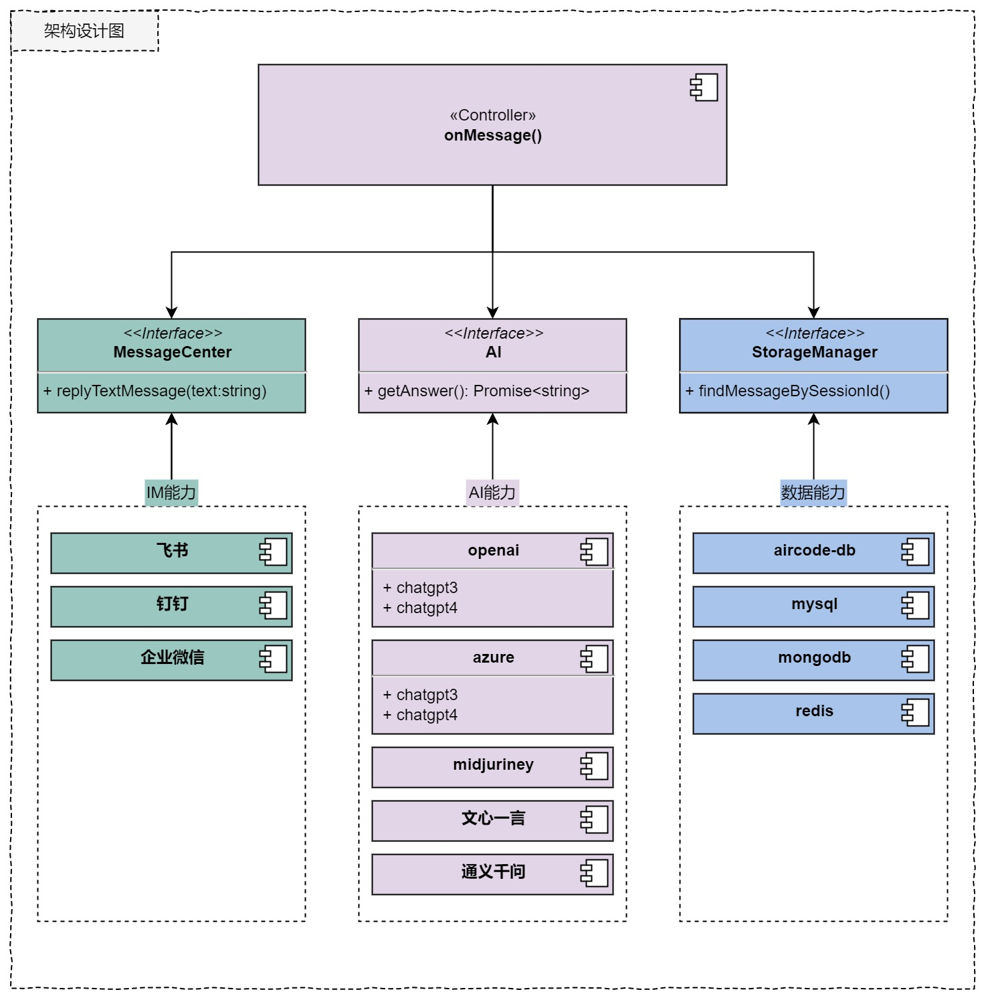

### 功能介绍
将`chatgpt`接入飞书，可通过私聊、群聊@的方式与chatgpt进行多轮连续会话。目前在飞书中已支持连续会话、流式响应、代码块显示等特性。


### 快速集成步骤
1. 创建一个飞书机器人，并为机器人开通消息相关权限，配置消息回调地址处理飞书消息；
2. 将代码部署到AirCode，并配置环境变量。[查看部署指南<<](https://tf38wzf3i8.feishu.cn/docx/PEG4dxjcnotqb3xauqoc2KqinLg)


### 本地开发指南
如果你想基于源码做一些开发，可以在项目根目录下使用以下命令来安装依赖（确保本地nodejs版本17+）：
```commandline
npm install
```

重新编译代码，构建产物位于项目根目录下的 `dist` 文件夹内：
```commandline
npm run build:feishu
```

### 环境变量配置说明
在项目根目录下的`.env`文件中配置环境变量：

| 配置项名 | 说明                        |
| -------- |---------------------------|
| FEISHU_APP_ID | 飞书的应用App ID               |
| FEISHU_APP_SECRET | 飞书的应用的App Secret          |
| FEISHU_BOT_NAME | 飞书机器人的名字                  |
| OPENAI_API_KEY | OpenAI的秘钥                 |
| OPENAI_API_MODEL | 使用的模型，默认gpt-3.5-turbo     |
| OPENAI_MODEL_MAX_TOKEN | 使用的模型最大TOKEN数量限制，默认4096   |
| POST_URL | 飞书消息交互行为回调地址，与飞书服务器回调地址一致 |

### 写在最后
如果该项目对您有所帮助，欢迎通过`issue`提出更多的想法和建议~~

### 附录：架构设计图


